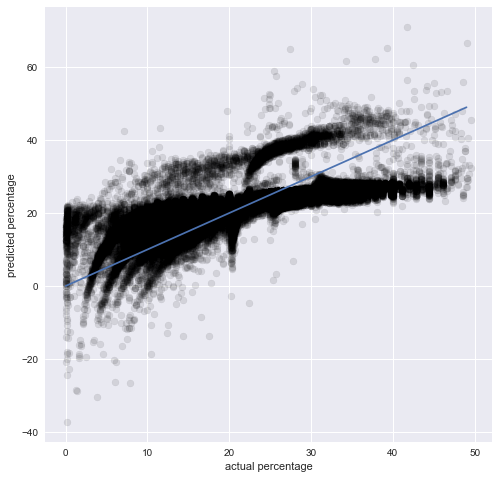
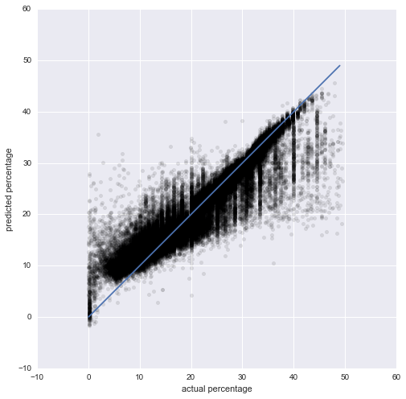
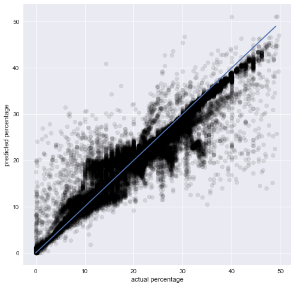

## This notebook is for modeling tip percentage with features processed by the previous notebook named as '2-1, Predicting tip percentage, data processing & feature engineering'. 

We will use three models - Linear Regression, XGBoost and Deep Neural Network. We will look at both the 'mean squared error' and the 'prediction vs. fact' plot to evaluate and compare model performance

### magic shortcuts to different models:

1. [Linear Regression](#1)
2. [XGBoost](#2)
3. [Deep Learning](#3)
4. [Conclusion](#4)


```python
# load library
import pandas as pd
import seaborn as sns
import matplotlib.pyplot as plt
%matplotlib inline
import numpy as np
import pickle
from sklearn.metrics import mean_squared_error # evaluation metrics
from scipy import sparse
```


```python
# load data
train_x = pickle.load(open('../../data/train_x.p', 'rb' ))
train_y = pickle.load(open('../../data/train_y.p', 'rb' ))
test_x = pickle.load(open('../../data/test_x.p', 'rb' ))
test_y = pickle.load(open('../../data/test_y.p', 'rb' ))
```

<a id = 1> </a>
## 1, Linear Regression

First, we will try a simple model - linear regression, as a baseline model to compare with.


```python
# modeling
from sklearn import linear_model
regr = linear_model.LinearRegression(fit_intercept = True, normalize = True)
regr.fit(train_x, train_y)
```


    LinearRegression(copy_X=True, fit_intercept=True, n_jobs=1, normalize=True)


```python
# evaluate model on testing data
regr_pred = regr.predict(test_x)
mean_squared_error(regr_pred, test_y)
```


    24.322271551093223


```python
# Plot outputs
# x-axis, actual value; 
# y-axis, predicted value.
fig = plt.figure(figsize=(8,8))
ax = fig.add_subplot(111)

ax.set_xlabel('actual percentage')
ax.set_ylabel('predicted percentage')

plt.scatter(test_y, regr_pred, color='black', alpha = .1)

# diagnoal line indicating perfect prediction
plt.plot(np.arange(0, 50), np.arange(0, 50)) 

plt.show()
```





<a id = 2> </a>
## 2, XGBoost

Reference: https://xgboost.readthedocs.io/en/latest/

Due to unknown reasons, the jupyter notebook would be frozen when the XGBoost model was initiated to train with a Bayesian optimization package (https://github.com/fmfn/BayesianOptimization). Intead of using jupyter notebook, the model was trained by calling a python program in Termial. 

The model was optimized to have the cross-validated mean squared error of 3.304 with several hyper-parameters been tuned as:
'reg_alpha': 0,
'reg_lambda': 10,
'colsample_bytree': 0.1,
'subsample': 1,
'min_child_weight': 1,
'max_depth': 20,
'alpha': 0,
'gamma': 0

A detailed explanation of these parameters can be found here: https://github.com/dmlc/xgboost/blob/master/doc/parameter.md


```python
# load libaray
import xgboost as xgb
```

    //anaconda/lib/python3.5/site-packages/sklearn/cross_validation.py:44: DeprecationWarning: This module was deprecated in version 0.18 in favor of the model_selection module into which all the refactored classes and functions are moved. Also note that the interface of the new CV iterators are different from that of this module. This module will be removed in 0.20.
      "This module will be removed in 0.20.", DeprecationWarning)


```python
# tuned parameter:
params = {  'n_estimators': 1000,
            'reg_alpha': 0,
            'reg_lambda': 10,
            'colsample_bytree': 0.1,
            'subsample': 1,
            'min_child_weight': 1,
            'max_depth': 20,
            'gamma': 0,
            'learning_rate': .1
         }
```


```python
# fit into training data to gererate model for prediction
xgb_regr = xgb.XGBRegressor(**params, nthread = 2)
xgb_regr.fit(train_x, train_y)
```


```python
# save model for future reference
with open('./xgboost_model.p', 'wb') as handle:
    pickle.dump(xgb_regr, handle, protocol=pickle.HIGHEST_PROTOCOL)
```


```python
# next time, load model from here:
xgb_regr = pickle.load(open('../../xgboost_model.p', 'rb' ))
```


```python
# evaluate model on testing data
xgb_pred = xgb_regr.predict(test_x)
np.mean(np.square(xgb_pred - test_y))
```


    7.3725706618518627


```python
# Plot outputs
# x-axis, actual value; 
# y-axis, predicted value.
fig = plt.figure(figsize=(8,8))
ax = fig.add_subplot(111)

ax.set_xlabel('actual percentage')
ax.set_ylabel('predicted percentage')

plt.scatter(test_y, xgb_pred, color='black', alpha = .1)

# diagnoal line indicating perfect prediction
plt.plot(np.arange(0, 50), np.arange(0, 50)) 

plt.show()
```





<a id = 3> </a>
## 3, Deep Neural Network

The network architecture was inspired by this article: http://gonzalopla.com/deep-learning-nonlinear-regression/. The original architecture was modified to have more hidden layers and more neurons in each layer. This modification decision was made after several experiments with different setups.


```python
# load library
from keras.layers import Dense
from keras.layers import Dropout
from keras.layers import Activation
from keras.models import Sequential
from keras import backend
from keras.callbacks import EarlyStopping
backend.backend()
import theano
print(theano.config.device) # trained with GPU to speed up computation
```

    cuda0


```python
model = Sequential()
 
# Input layer 128 neurons. 
model.add(Dense(128, input_dim=64, activation='relu'))
# Dropout of 20% of the neurons and activation layer.
model.add(Dropout(.2))
model.add(Activation("relu"))
# Hidden layer with 64 neurons.
model.add(Dense(128, activation='relu'))
# Hidden layer with 64 neurons.
model.add(Dense(64, activation='relu'))
# Hidden layer with 64 neurons.
model.add(Dense(64, activation='relu'))
# Output Layer.
model.add(Dense(1, activation='relu'))
    
    
# Model is derived and compiled using mean square error as loss function
model.compile(loss='mean_squared_error', optimizer='adam', metrics=["mean_squared_error"])
 
# Training model with train data. Fixed random seed:
np.random.seed(3)

# Early stopping
early_stopping = EarlyStopping(monitor = 'val_loss', min_delta = .001, 
                              patience = 10, verbose = 1, mode = 'auto')
# Training
model.fit(train_x.todense(), train_y, epochs = 1000, batch_size = 4069, 
          validation_split = .2, verbose = 1, callbacks = [early_stopping])
```

    Train on 376352 samples, validate on 94088 samples
    Epoch 1/1000
    376352/376352 [==============================] - 2s - loss: 104.4011 - mean_squared_error: 104.4011 - val_loss: 32.8661 - val_mean_squared_error: 32.8661
    Epoch 2/1000
    376352/376352 [==============================] - 1s - loss: 27.2138 - mean_squared_error: 27.2138 - val_loss: 21.8419 - val_mean_squared_error: 21.8419
    Epoch 3/1000
    376352/376352 [==============================] - 1s - loss: 17.4479 - mean_squared_error: 17.4479 - val_loss: 24.7519 - val_mean_squared_error: 24.7519
    Epoch 4/1000
    376352/376352 [==============================] - 1s - loss: 13.2230 - mean_squared_error: 13.2230 - val_loss: 19.1820 - val_mean_squared_error: 19.1820
    Epoch 5/1000
    376352/376352 [==============================] - 1s - loss: 11.3641 - mean_squared_error: 11.3641 - val_loss: 18.6287 - val_mean_squared_error: 18.6287
    Epoch 6/1000
    376352/376352 [==============================] - 1s - loss: 10.2673 - mean_squared_error: 10.2673 - val_loss: 16.2961 - val_mean_squared_error: 16.2961
    Epoch 7/1000
    376352/376352 [==============================] - 1s - loss: 9.5238 - mean_squared_error: 9.5238 - val_loss: 18.5714 - val_mean_squared_error: 18.5714
    Epoch 8/1000
    376352/376352 [==============================] - 1s - loss: 8.9849 - mean_squared_error: 8.9849 - val_loss: 16.4932 - val_mean_squared_error: 16.4932
    Epoch 9/1000
    376352/376352 [==============================] - 2s - loss: 8.5003 - mean_squared_error: 8.5003 - val_loss: 12.9254 - val_mean_squared_error: 12.9254
    Epoch 10/1000
    376352/376352 [==============================] - 2s - loss: 8.0873 - mean_squared_error: 8.0873 - val_loss: 12.9445 - val_mean_squared_error: 12.9445
    Epoch 11/1000
    376352/376352 [==============================] - 1s - loss: 7.8168 - mean_squared_error: 7.8168 - val_loss: 17.1438 - val_mean_squared_error: 17.1438
    Epoch 12/1000
    376352/376352 [==============================] - 1s - loss: 7.5178 - mean_squared_error: 7.5178 - val_loss: 10.1452 - val_mean_squared_error: 10.1452
    Epoch 13/1000
    376352/376352 [==============================] - 1s - loss: 7.1449 - mean_squared_error: 7.1449 - val_loss: 11.2812 - val_mean_squared_error: 11.2812
    Epoch 14/1000
    376352/376352 [==============================] - 1s - loss: 6.9127 - mean_squared_error: 6.9127 - val_loss: 10.6518 - val_mean_squared_error: 10.6518
    Epoch 15/1000
    376352/376352 [==============================] - 1s - loss: 6.6696 - mean_squared_error: 6.6696 - val_loss: 12.3501 - val_mean_squared_error: 12.3501
    Epoch 16/1000
    376352/376352 [==============================] - 1s - loss: 6.4527 - mean_squared_error: 6.4527 - val_loss: 9.3200 - val_mean_squared_error: 9.3200
    Epoch 17/1000
    376352/376352 [==============================] - 1s - loss: 6.2358 - mean_squared_error: 6.2358 - val_loss: 7.8744 - val_mean_squared_error: 7.8744
    Epoch 18/1000
    376352/376352 [==============================] - 1s - loss: 6.0180 - mean_squared_error: 6.0180 - val_loss: 7.8385 - val_mean_squared_error: 7.8385
    Epoch 19/1000
    376352/376352 [==============================] - 1s - loss: 5.9195 - mean_squared_error: 5.9195 - val_loss: 8.1754 - val_mean_squared_error: 8.1754
    Epoch 20/1000
    376352/376352 [==============================] - 1s - loss: 5.7206 - mean_squared_error: 5.7206 - val_loss: 6.9121 - val_mean_squared_error: 6.9121
    Epoch 21/1000
    376352/376352 [==============================] - 1s - loss: 5.5606 - mean_squared_error: 5.5606 - val_loss: 7.3640 - val_mean_squared_error: 7.3640
    Epoch 22/1000
    376352/376352 [==============================] - 1s - loss: 5.4006 - mean_squared_error: 5.4006 - val_loss: 5.6177 - val_mean_squared_error: 5.6177
    Epoch 23/1000
    376352/376352 [==============================] - 1s - loss: 5.2574 - mean_squared_error: 5.2574 - val_loss: 6.4523 - val_mean_squared_error: 6.4523
    Epoch 24/1000
    376352/376352 [==============================] - 1s - loss: 5.1770 - mean_squared_error: 5.1770 - val_loss: 5.6793 - val_mean_squared_error: 5.6793
    Epoch 25/1000
    376352/376352 [==============================] - 1s - loss: 5.0899 - mean_squared_error: 5.0899 - val_loss: 6.7497 - val_mean_squared_error: 6.7497
    Epoch 26/1000
    376352/376352 [==============================] - 1s - loss: 4.9920 - mean_squared_error: 4.9920 - val_loss: 4.9870 - val_mean_squared_error: 4.9870
    Epoch 27/1000
    376352/376352 [==============================] - 1s - loss: 4.9685 - mean_squared_error: 4.9685 - val_loss: 4.7398 - val_mean_squared_error: 4.7398
    Epoch 28/1000
    376352/376352 [==============================] - 1s - loss: 4.8916 - mean_squared_error: 4.8916 - val_loss: 4.7504 - val_mean_squared_error: 4.7504
    Epoch 29/1000
    376352/376352 [==============================] - 1s - loss: 4.8160 - mean_squared_error: 4.8160 - val_loss: 5.4403 - val_mean_squared_error: 5.4403
    Epoch 30/1000
    376352/376352 [==============================] - 1s - loss: 4.7541 - mean_squared_error: 4.7541 - val_loss: 5.0846 - val_mean_squared_error: 5.0846
    Epoch 31/1000
    376352/376352 [==============================] - 1s - loss: 4.7002 - mean_squared_error: 4.7002 - val_loss: 4.7227 - val_mean_squared_error: 4.7227
    Epoch 32/1000
    376352/376352 [==============================] - 1s - loss: 4.6533 - mean_squared_error: 4.6533 - val_loss: 4.4149 - val_mean_squared_error: 4.4149
    Epoch 33/1000
    376352/376352 [==============================] - 1s - loss: 4.5994 - mean_squared_error: 4.5994 - val_loss: 4.4882 - val_mean_squared_error: 4.4882
    Epoch 34/1000
    376352/376352 [==============================] - 1s - loss: 4.5869 - mean_squared_error: 4.5869 - val_loss: 4.3908 - val_mean_squared_error: 4.3908
    Epoch 35/1000
    376352/376352 [==============================] - 1s - loss: 4.4975 - mean_squared_error: 4.4975 - val_loss: 4.6557 - val_mean_squared_error: 4.6557
    Epoch 36/1000
    376352/376352 [==============================] - 1s - loss: 4.5317 - mean_squared_error: 4.5317 - val_loss: 4.0492 - val_mean_squared_error: 4.0492
    Epoch 37/1000
    376352/376352 [==============================] - 1s - loss: 4.4926 - mean_squared_error: 4.4926 - val_loss: 4.2197 - val_mean_squared_error: 4.2197
    Epoch 38/1000
    376352/376352 [==============================] - 1s - loss: 4.3837 - mean_squared_error: 4.3837 - val_loss: 4.2750 - val_mean_squared_error: 4.2750
    Epoch 39/1000
    376352/376352 [==============================] - 1s - loss: 4.3935 - mean_squared_error: 4.3935 - val_loss: 4.2199 - val_mean_squared_error: 4.2199
    Epoch 40/1000
    376352/376352 [==============================] - 1s - loss: 4.3676 - mean_squared_error: 4.3676 - val_loss: 4.1166 - val_mean_squared_error: 4.1166
    Epoch 41/1000
    376352/376352 [==============================] - 1s - loss: 4.3303 - mean_squared_error: 4.3303 - val_loss: 4.3116 - val_mean_squared_error: 4.3116
    Epoch 42/1000
    376352/376352 [==============================] - 1s - loss: 4.2900 - mean_squared_error: 4.2900 - val_loss: 3.9253 - val_mean_squared_error: 3.9253
    Epoch 43/1000
    376352/376352 [==============================] - 1s - loss: 4.2730 - mean_squared_error: 4.2730 - val_loss: 4.1313 - val_mean_squared_error: 4.1313
    Epoch 44/1000
    376352/376352 [==============================] - 1s - loss: 4.3005 - mean_squared_error: 4.3005 - val_loss: 4.0383 - val_mean_squared_error: 4.0383
    Epoch 45/1000
    376352/376352 [==============================] - 1s - loss: 4.2477 - mean_squared_error: 4.2477 - val_loss: 4.0206 - val_mean_squared_error: 4.0206
    Epoch 46/1000
    376352/376352 [==============================] - 1s - loss: 4.2485 - mean_squared_error: 4.2485 - val_loss: 3.9980 - val_mean_squared_error: 3.9980
    Epoch 47/1000
    376352/376352 [==============================] - 1s - loss: 4.1968 - mean_squared_error: 4.1968 - val_loss: 4.0002 - val_mean_squared_error: 4.0002
    Epoch 48/1000
    376352/376352 [==============================] - 1s - loss: 4.1698 - mean_squared_error: 4.1698 - val_loss: 3.9684 - val_mean_squared_error: 3.9684
    Epoch 49/1000
    376352/376352 [==============================] - 1s - loss: 4.1710 - mean_squared_error: 4.1710 - val_loss: 4.2634 - val_mean_squared_error: 4.2634
    Epoch 50/1000
    376352/376352 [==============================] - 1s - loss: 4.1637 - mean_squared_error: 4.1637 - val_loss: 3.8752 - val_mean_squared_error: 3.8752
    Epoch 51/1000
    376352/376352 [==============================] - 1s - loss: 4.1342 - mean_squared_error: 4.1342 - val_loss: 3.8779 - val_mean_squared_error: 3.8779
    Epoch 52/1000
    376352/376352 [==============================] - 1s - loss: 4.1314 - mean_squared_error: 4.1314 - val_loss: 3.9037 - val_mean_squared_error: 3.9037
    Epoch 53/1000
    376352/376352 [==============================] - 1s - loss: 4.0935 - mean_squared_error: 4.0935 - val_loss: 4.2718 - val_mean_squared_error: 4.2718
    Epoch 54/1000
    376352/376352 [==============================] - 1s - loss: 4.0955 - mean_squared_error: 4.0955 - val_loss: 3.9241 - val_mean_squared_error: 3.9241
    Epoch 55/1000
    376352/376352 [==============================] - 1s - loss: 4.0702 - mean_squared_error: 4.0702 - val_loss: 3.9004 - val_mean_squared_error: 3.9004
    Epoch 56/1000
    376352/376352 [==============================] - 1s - loss: 4.0425 - mean_squared_error: 4.0425 - val_loss: 3.9566 - val_mean_squared_error: 3.9566
    Epoch 57/1000
    376352/376352 [==============================] - 1s - loss: 4.0599 - mean_squared_error: 4.0599 - val_loss: 3.9564 - val_mean_squared_error: 3.9564
    Epoch 58/1000
    376352/376352 [==============================] - 1s - loss: 4.0143 - mean_squared_error: 4.0143 - val_loss: 4.2269 - val_mean_squared_error: 4.2269
    Epoch 59/1000
    376352/376352 [==============================] - 1s - loss: 4.0186 - mean_squared_error: 4.0186 - val_loss: 3.8352 - val_mean_squared_error: 3.8352
    Epoch 60/1000
    376352/376352 [==============================] - 1s - loss: 4.0274 - mean_squared_error: 4.0274 - val_loss: 3.9442 - val_mean_squared_error: 3.9442
    Epoch 61/1000
    376352/376352 [==============================] - 1s - loss: 4.0298 - mean_squared_error: 4.0298 - val_loss: 3.7894 - val_mean_squared_error: 3.7894
    Epoch 62/1000
    376352/376352 [==============================] - 1s - loss: 4.0141 - mean_squared_error: 4.0141 - val_loss: 3.6730 - val_mean_squared_error: 3.6730
    Epoch 63/1000
    376352/376352 [==============================] - 1s - loss: 3.9437 - mean_squared_error: 3.9437 - val_loss: 3.7637 - val_mean_squared_error: 3.7637
    Epoch 64/1000
    376352/376352 [==============================] - 1s - loss: 3.9593 - mean_squared_error: 3.9593 - val_loss: 3.8137 - val_mean_squared_error: 3.8137
    Epoch 65/1000
    376352/376352 [==============================] - 1s - loss: 3.9591 - mean_squared_error: 3.9591 - val_loss: 3.7345 - val_mean_squared_error: 3.7345
    Epoch 66/1000
    376352/376352 [==============================] - 1s - loss: 3.8756 - mean_squared_error: 3.8756 - val_loss: 4.0532 - val_mean_squared_error: 4.0532
    Epoch 67/1000
    376352/376352 [==============================] - 2s - loss: 3.9127 - mean_squared_error: 3.9127 - val_loss: 3.8483 - val_mean_squared_error: 3.8483
    Epoch 68/1000
    376352/376352 [==============================] - 2s - loss: 3.9148 - mean_squared_error: 3.9148 - val_loss: 3.7417 - val_mean_squared_error: 3.7417
    Epoch 69/1000
    376352/376352 [==============================] - 2s - loss: 3.8679 - mean_squared_error: 3.8679 - val_loss: 3.6244 - val_mean_squared_error: 3.6244
    Epoch 70/1000
    376352/376352 [==============================] - 2s - loss: 3.8757 - mean_squared_error: 3.8757 - val_loss: 3.9779 - val_mean_squared_error: 3.9779
    Epoch 71/1000
    376352/376352 [==============================] - 1s - loss: 3.8217 - mean_squared_error: 3.8217 - val_loss: 4.0222 - val_mean_squared_error: 4.0222
    Epoch 72/1000
    376352/376352 [==============================] - 1s - loss: 3.8501 - mean_squared_error: 3.8501 - val_loss: 3.6691 - val_mean_squared_error: 3.6691
    Epoch 73/1000
    376352/376352 [==============================] - 1s - loss: 3.8390 - mean_squared_error: 3.8390 - val_loss: 4.0371 - val_mean_squared_error: 4.0371
    Epoch 74/1000
    376352/376352 [==============================] - 1s - loss: 3.8454 - mean_squared_error: 3.8454 - val_loss: 3.9225 - val_mean_squared_error: 3.9225
    Epoch 75/1000
    376352/376352 [==============================] - 1s - loss: 3.8277 - mean_squared_error: 3.8277 - val_loss: 3.7048 - val_mean_squared_error: 3.7048
    Epoch 76/1000
    376352/376352 [==============================] - 1s - loss: 3.8100 - mean_squared_error: 3.8100 - val_loss: 4.0099 - val_mean_squared_error: 4.0099
    Epoch 77/1000
    376352/376352 [==============================] - 1s - loss: 3.8441 - mean_squared_error: 3.8441 - val_loss: 3.8905 - val_mean_squared_error: 3.8905
    Epoch 78/1000
    376352/376352 [==============================] - 1s - loss: 3.7827 - mean_squared_error: 3.7827 - val_loss: 3.7746 - val_mean_squared_error: 3.7746
    Epoch 79/1000
    376352/376352 [==============================] - 1s - loss: 3.7204 - mean_squared_error: 3.7204 - val_loss: 3.8871 - val_mean_squared_error: 3.8871
    Epoch 80/1000
    376352/376352 [==============================] - 1s - loss: 3.7581 - mean_squared_error: 3.7581 - val_loss: 3.9765 - val_mean_squared_error: 3.9765
    Epoch 00079: early stopping


    <keras.callbacks.History at 0x112d5b630>


```python
# save model for future reference
model_json = model.to_json()
import json
with open('./deep_learning_model.json', 'w') as outfile:
    json.dump(model_json, outfile)
```


```python
# next time, load model from here
import json
from keras.models import model_from_json
with open('./deep_learning_model.json') as model_file:
    model_json = json.loads(model_file.read())
model1 = model_from_json(model_json)
```


```python
# evaluate model on testing data
dl_pred = model.predict(test_x.todense())
mean_squared_error(dl_pred, test_y)
```


    3.9055187968490483


```python
# Plot outputs
# x-axis, actual value; 
# y-axis, predicted value.
fig = plt.figure(figsize=(8,8))
ax = fig.add_subplot(111)

ax.set_xlabel('actual percentage')
ax.set_ylabel('predicted percentage')

plt.scatter(test_y, dl_pred, color='black', alpha = .1)

# diagnoal line indicating perfect prediction
plt.plot(np.arange(0, 50), np.arange(0, 50)) 

plt.show()
```





<a id = 4> </a>
## 4, Conclusion

The analysis above suggests the deep learning model outperforms the other two models. It is clear that the deep learning model has a lowered mean squared error in the testing dataset: 3.906 as opposed to 7.373 of the XGBoost model and 24.322 of the Linear Regression model. The plot of predicted against actual values also supports this.

It is noteworthy to point out that the model performance can be further improved by various ways that have been ignored by this exercise due to time constraint. For example, applying Box-Cox transformation on continuously-valued features is often a widely accepted technique to improve prediction results. Moreover, there are transactions with fare around $1, which are dubious ones because the low amount of money. It might be helpful to exclude these transactions from the analysis.

Finally, the analysis didn't include cases with zero tip. However, given the large amount of zero tip transactions (over half of the total transactions. Some New Yorkers are so mean!!!), we might want to consider to design a classification model to predict the probability that if tips will be paid. If the
classification model gives a positive prediction, we will use a second model for regression prediction.


```python

```
