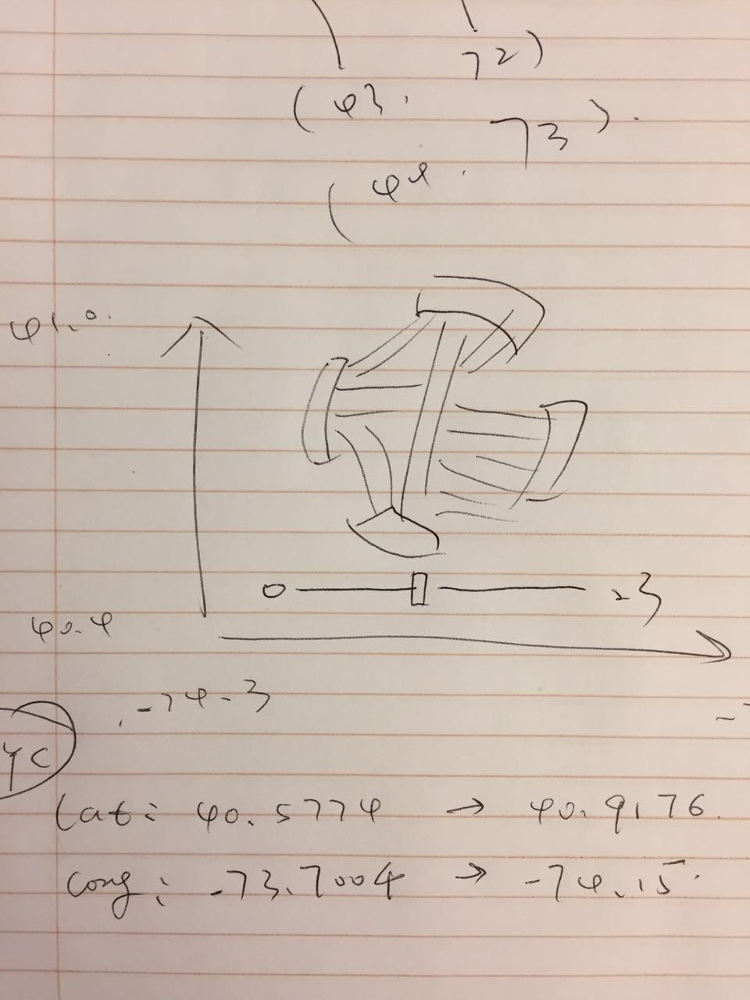
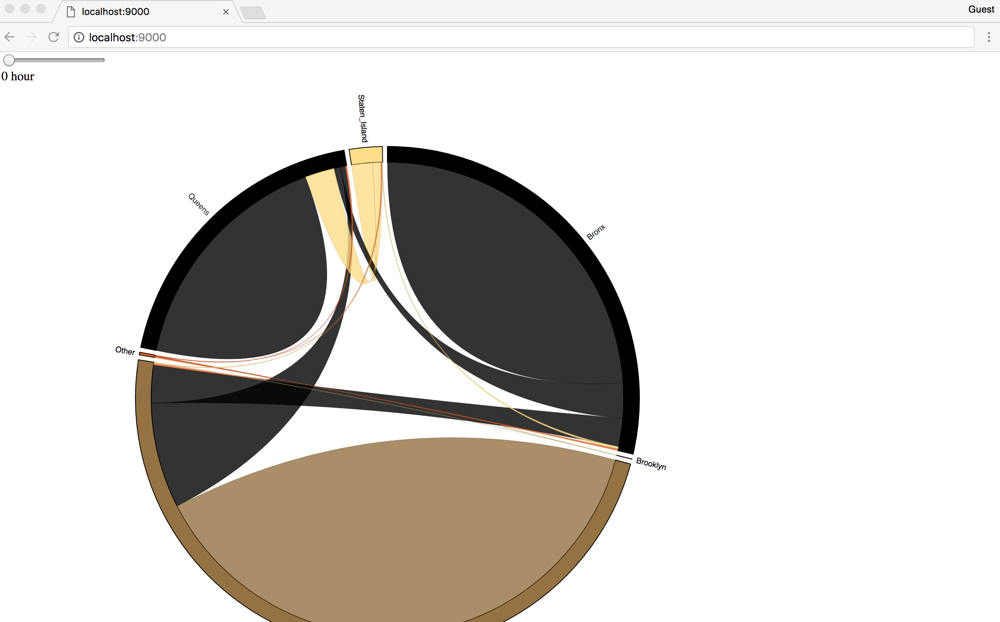
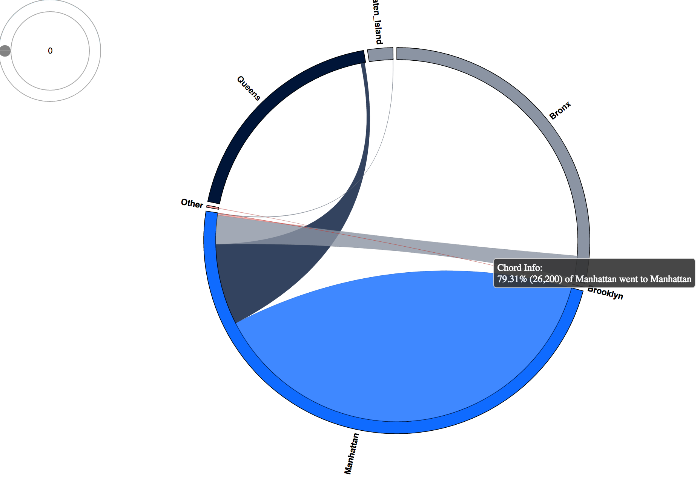
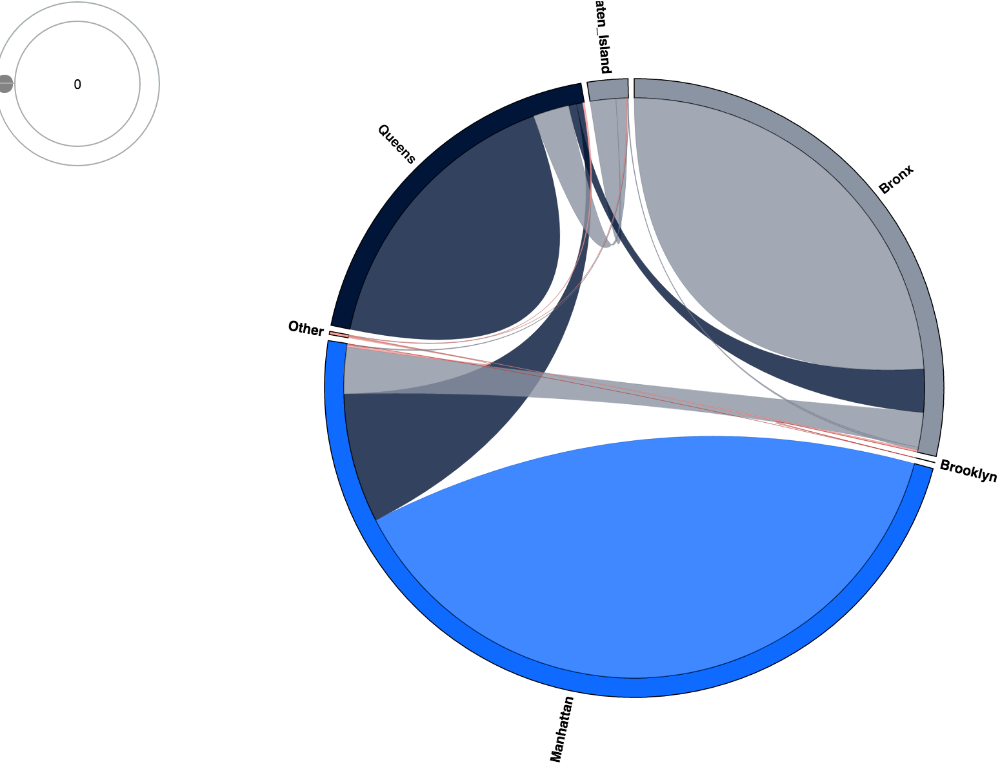
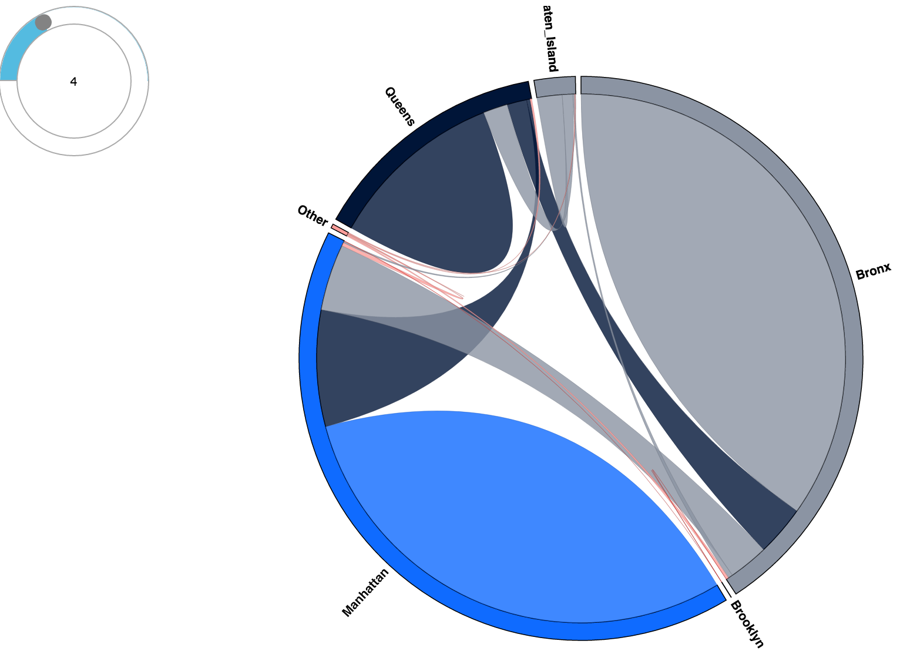
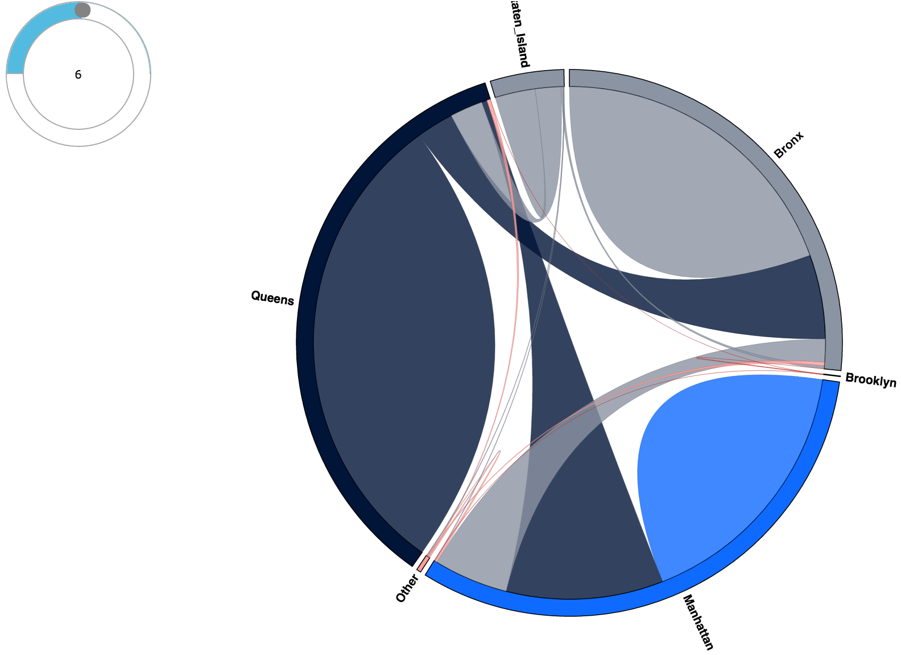
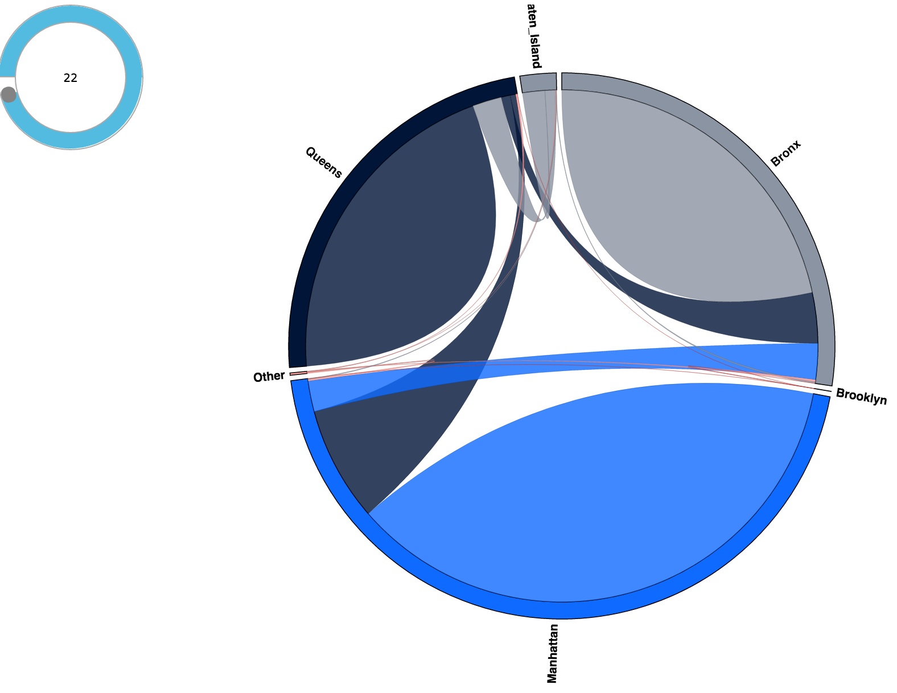

## This notebook is for generating data for visualization, illustrating development process and providing instructions for running visualization code.

The interactive visualization was wrote in d3 with other web development tools such as jQuery and a jQuery plugin called roundSlider for implementing a circular slider bar as a controlling tool to interact with the visualization.

The visualization used chord diagram (https://en.wikipedia.org/wiki/Chord_diagram) to represent the inter-/intra-borough traffic. There is a circular slider bar at the top left corner, which represents a clock with 24 hours. The user can drag the round slider to explore the traffic flow as time progresses during a day. The center of the circular slider bar shows text to indicate the hour of the day. Some of the code for implementing this visualization was borrowed from http://projects.delimited.io/experiments/chord-diagrams/hair.html


## Task 5
* Visualization.

Can you build a visualization (interactive or static) of the trip data that helps us understand intra- vs. inter-borough traffic? What story does it tell about how New Yorkers use their green taxis?

## magic shortcuts to subsections:

* [Generating data](#1)

* [Development process](#2)

* [How to run visualization code](#3)

* [Conclusion](#4)

<a id = 1> </a>
### Generating data

The purpose of this section is to calculate the data needed for visualization. We will group all the transactions by 0-23 hour of the day and five boroughs. In the end, we will have a table with the number of trips happened in each of the borough area from 0 to 23 o'clock


```python
# load library
import pandas as pd
import pickle
```


```python
# pick-up hour
pick_up_hr = pd.DatetimeIndex(dataset['lpep_pickup_datetime'])
pick_up_hr = pick_up_hr.hour
```


```python
# load pickup and dropoff boro
pickup_boro = pickle.load(open('./data/pickup_boro.p', 'rb' ))
dropoff_boro = pickle.load(open('./data/dropoff_boro.p', 'rb' ))
```


```python
dataset = pd.DataFrame({'hr': pick_up_hr, 'pickup_boro': pickup_boro, 'dropoff_boro': dropoff_boro})
```


```python
# map integer endoing into real names
dataset['pickup_boro'].replace([0, 1, 2, 3, 4, 5],
                               ['Other', 'Manhattan', 'Bronx', 'Brooklyn', 'Queens', 'Staten_Island'],
                              inplace = True)
```


```python
dataset['dropoff_boro'].replace([0, 1, 2, 3, 4, 5],
                               ['Other', 'Manhattan', 'Bronx', 'Brooklyn', 'Queens', 'Staten_Island'],
                              inplace = True)
```


```python
# calculated data needed
dataset_summary = dataset.groupby(['hr', 'pickup_boro', 'dropoff_boro']).size().reset_index(name='count')
```


```python
dataset_summary.head(2)
```


<div>
<table border="1" class="dataframe">
  <thead>
    <tr style="text-align: right;">
      <th></th>
      <th>hr</th>
      <th>pickup_boro</th>
      <th>dropoff_boro</th>
      <th>count</th>
    </tr>
  </thead>
  <tbody>
    <tr>
      <th>0</th>
      <td>0</td>
      <td>Bronx</td>
      <td>Bronx</td>
      <td>16400</td>
    </tr>
    <tr>
      <th>1</th>
      <td>0</td>
      <td>Bronx</td>
      <td>Brooklyn</td>
      <td>5</td>
    </tr>
  </tbody>
</table>
</div>


```python
# save data
for i in range(24):
    data_2_save = dataset_summary[dataset_summary['hr'] == i].iloc[:, 1:4]
    file_path = './data/viz_data/' + str(i) + '.csv'
    data_2_save.to_csv(file_path, index = False, header = True)
```

<a id = 2> </a>
### Development process

This section shows how the visualization was developed step by step. Draft and different versions will be presented.

* The journey started with a hand draft:



* First version:
    


* Final version:

    - Improved color schema
    - Improved UI by using a circular bar to repsent a 24-hour clock
    


<a id = 3> </a>
### How to run visualization code

This visualization was developed with mac and tested only in Chrome. It is highly recommended to run the code on a mac computer and view the visualization in Chrome.

http://students.washington.edu/jinqu/viz_traffic_boro/


<a id = 4> </a>
### Conclusion

This visualization tool provides an interactive and qualitative overview of both inter- and intra-borough green cab traffic flow in New York City and would help users better understand the dynamic of green cab customers travelling behavior. 

For example, the following diagram shows all the trips happened at 0:00 a.m. :



It's easy to find out that most of the trips happened in Manhattan, Bronx and Queens. Manhattan had the largest number of trips compared with other areas. Intra-borough traffic was the predominant traffic flow in all of these three boroughs. 

At 4:00 a.m., the traffic flow shifted. Trips at the Bronx area increased a lot and became as busy as the Manhattan area while trips at the Queens area decreased:



At 6:00 a.m. , Queens suddenly became the most busy area:



The above situation continued until 22:00, the Manhattan area re-claimed as the most busy area:



This is just one story that user can learn from this visualization tool and illustrates its effectiveness in conveying information about traffic flow dynamics. The user can also focus upon one area and watch closely how inter- and intra-borough change over time in that area, etc.
